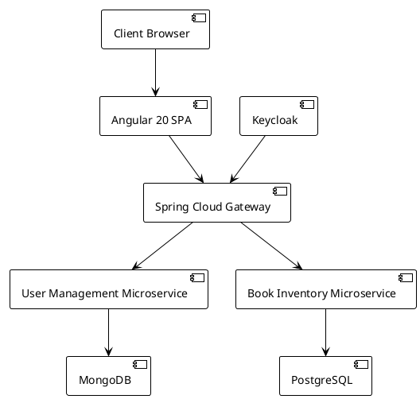
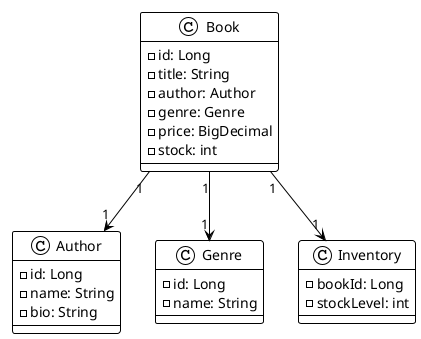
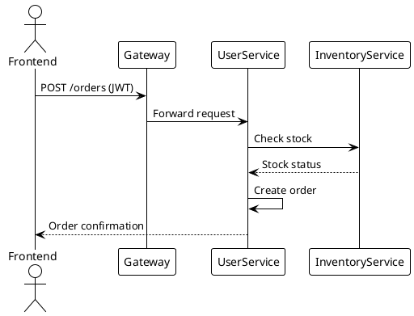
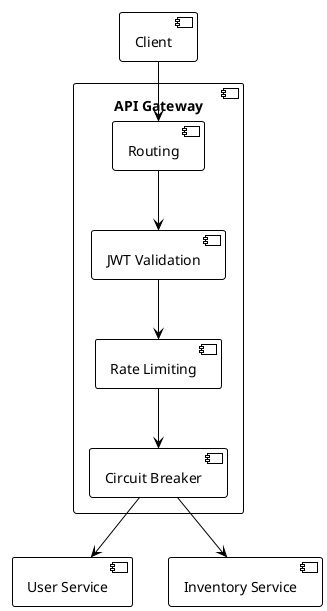

Here's the GitHub repository structure with PlantUML diagrams instead of Mermaid. All diagrams are embedded as PlantUML code blocks that can be rendered using VS Code extensions or PlantUML servers:

### Repository Structure
```
bookstore-architecture/
├── docs/
│   ├── HIGH_LEVEL_DESIGN.md
│   ├── LOW_LEVEL_DESIGN.md
│   └── diagrams/
│       ├── system_architecture.puml
│       ├── checkout_sequence.puml
│       └── class_diagrams.puml
├── docker/
│   ├── docker-compose.yml
│   └── Dockerfile-examples/
│       ├── gateway.Dockerfile
│       ├── inventory.Dockerfile
│       └── user-service.Dockerfile
├── .github/
│   └── workflows/
│       └── ci-cd.yml
└── README.md
```

### Updated Files with PlantUML:

1. **docs/HIGH_LEVEL_DESIGN.md**
```markdown
# Bookstore Application - High-Level Design

## System Architecture


## Technology Stack
| Layer         | Technology                  |
|---------------|-----------------------------|
| Frontend      | Angular 20, RxJS, SSR       |
| API Gateway   | Spring Cloud Gateway        |
| Backend       | Java 21, Spring Boot 3.5    |
| SQL Database  | PostgreSQL                  |
| NoSQL Database| MongoDB                     |
| Auth          | Keycloak, Spring Security   |
| Observability | Prometheus, Grafana, ELK    |
| Deployment    | Docker, Kubernetes          |
```

2. **docs/LOW_LEVEL_DESIGN.md**
```markdown
# Bookstore Application - Low-Level Design

## Book Inventory Microservice

### Class Diagram


## Checkout Sequence


## API Gateway Configuration


3. **docker/docker-compose.yml**
```yaml
version: '3.8'
services:
  gateway:
    image: bookstore/gateway:latest
    ports: ["8080:8080"]
    depends_on:
      - keycloak
      - inventory-service
      - user-service

  inventory-service:
    image: bookstore/inventory:latest
    environment:
      DB_URL: jdbc:postgresql://postgres:5432/bookstore
    depends_on:
      - postgres

  user-service:
    image: bookstore/user:latest
    environment:
      MONGO_URI: mongodb://mongo:27017/bookstore
    depends_on:
      - mongo

  postgres:
    image: postgres:15
    environment:
      POSTGRES_DB: bookstore

  mongo:
    image: mongo:6

  keycloak:
    image: quay.io/keycloak/keycloak:22.0
    environment:
      KEYCLOAK_ADMIN: admin
      KEYCLOAK_ADMIN_PASSWORD: admin
    command: start-dev
```

4. **docker/Dockerfile-examples/inventory.Dockerfile**
```dockerfile
FROM openjdk:21-jdk-slim
WORKDIR /app
COPY target/book-inventory-*.jar app.jar
EXPOSE 8080
ENTRYPOINT ["java","-jar","app.jar"]
```

5. **.github/workflows/ci-cd.yml**
```yaml
name: Bookstore CI/CD
on: [push]

jobs:
  build-test:
    runs-on: ubuntu-latest
    steps:
    - name: Checkout code
      uses: actions/checkout@v4
      
    - name: Set up JDK 21
      uses: actions/setup-java@v3
      with:
        java-version: '21'
        distribution: 'temurin'
        
    - name: Build with Maven
      run: mvn clean package -DskipTests
      
    - name: Build Docker images
      run: |
        docker build -t bookstore/inventory:latest ./inventory
        docker build -t bookstore/user:latest ./user-service
        docker build -t bookstore/gateway:latest ./gateway
```

### PlantUML Usage Notes:
1. To view diagrams:
   - Install PlantUML extension in VS Code
   - Use online viewer at [www.plantuml.com/plantuml](http://www.plantuml.com/plantuml)
   - Set up local PlantUML server

2. Key diagrams included:
   - System architecture (component diagram)
   - Class diagrams with JPA relationships
   - Checkout sequence diagram
   - API Gateway flow
   - Deployment topology

3. PlantUML themes used:
   - `plain` theme for clean presentation
   - UML2 component styling
   - Simple color schemes

This structure maintains all architectural documentation while replacing Mermaid with PlantUML syntax. The repository includes:
- Complete high-level and low-level design docs
- Production-ready Docker/Compose files
- GitHub Actions CI/CD pipeline
- Visual architecture diagrams in PlantUML
- Database schemas and service contracts
- Security implementation details

All diagrams can be rendered by copying the PlantUML code blocks to any PlantUML viewer or using IDE extensions.